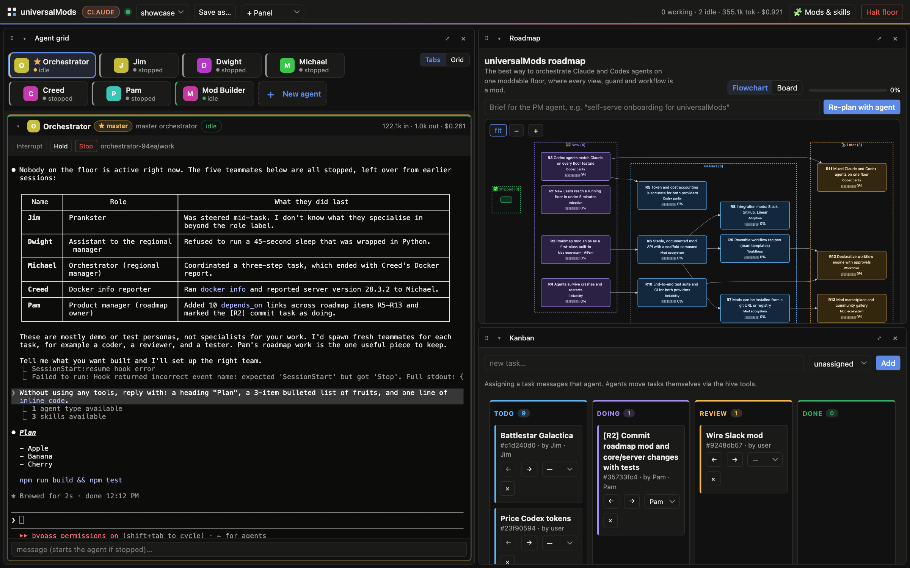
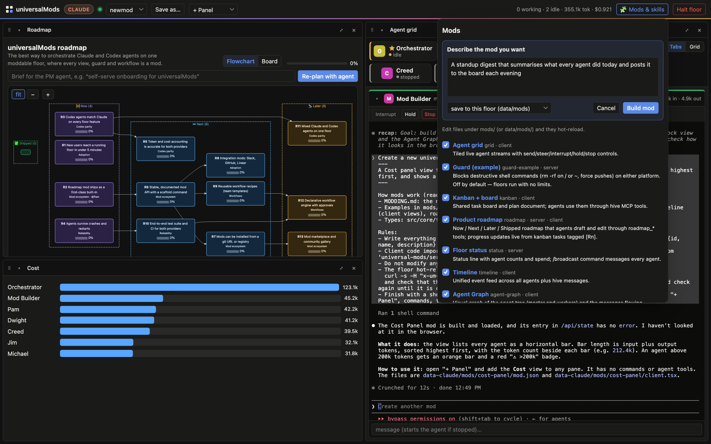
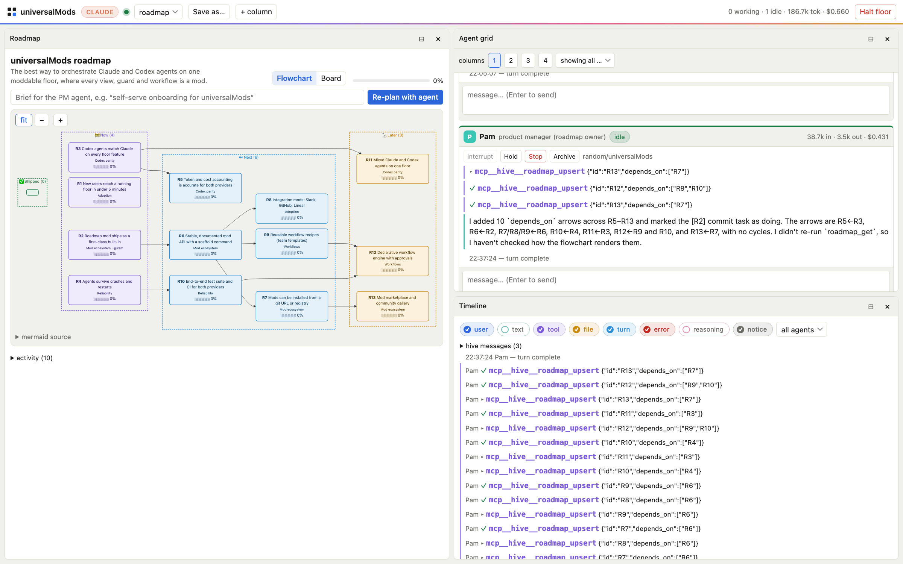

# universalMods

Claude-Code-style **mods** plus a web **floor** for running and steering many agents, on either platform:

- **Claude Code**: one long-lived `claude -p` stream-json process per agent.
- **Codex**: one `codex app-server` (JSON-RPC) per agent.

> **Note:** universalMods currently targets **Codex** and **Claude Code** only. Support for more agent platforms is coming. Each one is a provider (runtime plus config adapter) under `src/providers/`, so contributions are welcome.

A floor runs **one platform only**. Claude and Codex agents never share a floor, because their configs differ (see [Platform config](#platform-config)).

The shell is deliberately thin. Every view, guard, status line and command is a mod, so you can re-mod the UI for any use case.

Inspired by [Munder Difflin](https://github.com/chaitanyagiri/munder-difflin) (agent orchestration as an office floor) and Claude Code mods (hackable harness hooks).





<details><summary>Light mode</summary>



</details>

## Quick start

```bash
npm install
npm run dev                                       # first run: pick Claude or Codex in the browser
npm run dev -- --provider codex --data ./data-codex --port 4478   # a second floor for the other platform
```

Open the URL the server prints (`http://127.0.0.1:4477/?token=…`).

Requirements:
- Node 20 or later.
- `claude` (Claude Code), logged in.
- Or `codex` (`npm i -g @openai/codex && codex login`).

## What you get

| Feature | Details |
|---|---|
| Spawner | Name, role, model, effort, working dir or its own **git worktree**, skills, first prompt |
| Agent grid | Live stream per agent. **Send** queues the next turn. **⌘/Ctrl+Enter steers** the running turn. Also Interrupt / Hold / Stop / Archive |
| Hive (shared by agents and you) | Kanban, plan board and messages, exposed to every agent as `hive` MCP tools: `list_agents`, `send_message`, `spawn_agent`, `task_*`, `board_*`, `ask_user` |
| Timeline | Every event from every agent, filterable |
| "Needs you" tray | Shows `ask_user` questions. The agent blocks until you answer |
| Floor controls | Halt/resume the whole floor, `/broadcast` (status mod), status line with token and $ totals |
| Roadmap | A live Mermaid flowchart (Shipped → Now → Next → Later, with dependency arrows) or a board. A PM agent drafts it from a brief, and progress moves as kanban tasks tagged `[R3]` get done |
| Layouts | Panes of any view in columns. Split, close and switch views, then save named layouts (`ops`, `plan`, `focus`, `roadmap` built in). Open one directly with `?layout=<name>` |
| No limits | Claude uses `bypassPermissions`. Codex uses `danger-full-access` and approval `never`. Guards are opt-in mods |

## Platform config

The two config adapters live in `src/providers/<platform>/config.ts`. Your global `~/.claude` / `~/.codex` stays untouched and still applies (auth, models, your MCP servers). Before anything is written, each agent's config passes through the `config.build` mod hook. You can inspect the result in the **Agent config** view.

| Concept | Claude | Codex |
|---|---|---|
| Where config goes | `agents/<id>/claude/settings.json` via `--settings` | `-c key=<toml>` on the agent's app-server, plus `thread/start` params (mirror in `agents/<id>/codex/config.toml`) |
| No limits | `--dangerously-skip-permissions` | `sandbox: danger-full-access`, `approvalPolicy: never` |
| Instructions | `--append-system-prompt` | `developerInstructions` |
| Skills | session plugin via `--plugin-dir` (nothing written to your repo) | symlinked into `<cwd>/.agents/skills` |
| Hive MCP | `--mcp-config` JSON | `mcp_servers.hive` override |
| Hooks bridge | `hooks` in settings.json → `bin/um-hook.mjs` | `[hooks]` override + `--dangerously-bypass-hook-trust` → `bin/um-hook.mjs` |
| Steer | interrupt, then continue the session with the steer text | native `turn/steer` |
| Resume after restart | `--resume <session>` | `thread/resume` |

## Layout

```
src/core        event bus (hook chain), mod runtime (esbuild + hot reload), stores, types
src/providers   claude/ and codex/: config adapter, runtime, stream normalizer
src/server      floor (agents/queues), hive (files), http+ws API, MCP + hook bridges
src/web         shell, client SDK (`universal-mods`), built-in Mods & Agent config views
bin/            hive-mcp.mjs (stdio MCP server), um-hook.mjs (hook bridge)
mods/           spawner, grid, timeline, kanban, roadmap, status, guard-example
data/           per-floor state (gitignored): floor.json, registry, tasks, board, events
```

Writing mods is covered in [MODDING.md](MODDING.md).

## Security

Agents run with **no permission limits** and can do anything your user account can.
- The server binds to `127.0.0.1` and requires the per-run token for every API call and for the WebSocket.
- `--host 0.0.0.0` exposes that power to anyone holding the token.

## Scripts

`npm test` runs the unit tests (vitest). `npm run build` runs `tsc` and then bundles the shell and every mod for both platforms.

## License

[MIT](LICENSE)
